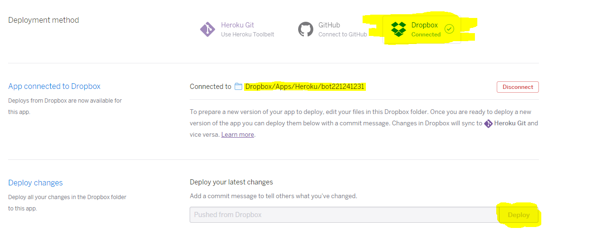

Slacker_BuildPack
====

1. __[Heroku](https://dashboard.heroku.com/)__에 `Slacker`용 앱을 생성합니다.<br>

2. deploy 메소드를 __Dropbox__ 로 선택하고 드랍박스를 연동합니다.<br>
<br>

3. 생성된 드랍박스 폴더에 `Slacker` 폴더를 만들고 봇을 위치시킵니다.<br>
   (최종적으로 실행파일의 위치는 Heroku/APP_NAME/Slacker/Slacker.exe 가 되도록)

4. `token`이나 `script_options.json` 파일 등의 설정파일은 exe와 같은 위치가 아닌 `Heroku/APP_NAME/` 폴더 아래에 오도록 합니다.

5. __Procfile__을 아래와같이 작성합니다.
```
worker: /app/mono/bin/mono Slacker/Slacker.exe
```

6. 디플로이 ㄱ
